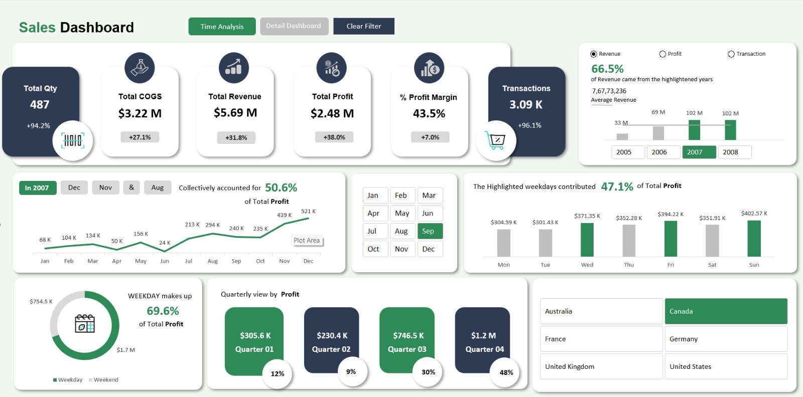
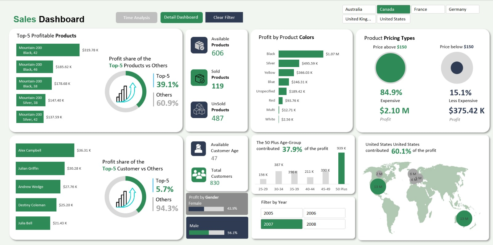

📊 Excel Sales Dashboard

Overview

An interactive sales dashboard built in Microsoft Excel to analyze revenue, profit, transactions, customer behavior, product performance, and regional trends.

The dashboard uses Pivot Tables, Pivot Charts, Slicers, KPI Cards, Form Controls, and a VBA-based filter reset button to provide dynamic business insights through an intuitive and interactive interface.

---

Dataset

The source dataset used for building the dashboard is available in the "dataset" folder.

---

Dashboard Preview

---

Key Features

- Dynamic KPI Cards
- Year-over-Year (YOY) Analysis
- Year & Month Slicers
- Dashboard Navigation Buttons
- Clear Filters Button (Recorded VBA Macro)
- Dynamic Metric Selection (Revenue, Profit, Transactions)
- Product Performance Analysis
- Customer Analysis
- Country-wise Analysis
- Bubble Map Visualization
- Conditional Highlighting of Top Performers

---

Skills Demonstrated

- Dashboard Design
- Data Visualization
- KPI Development
- Business Reporting
- Interactive Filtering
- Excel Automation
- Data Storytelling

---

Excel Features Used

- Pivot Tables
- Pivot Charts
- Slicers
- Form Controls
- Conditional Formatting
- GETPIVOTDATA Functions
- Recorded VBA Macro
- Interactive Dashboard Design

---

Tools Used

- Microsoft Excel
- VBA (Macro Recording)
